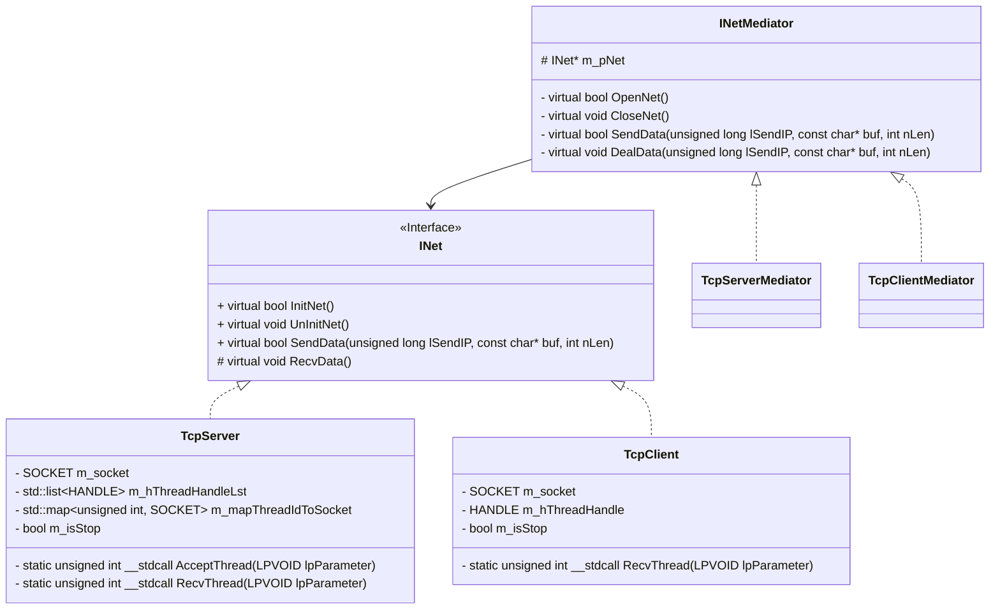
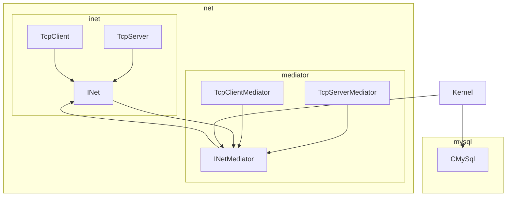

# Server端

## 开发环境

*   Visual Studio 2022

## 数据库设计

*   用户信息表(暂定TODO)

```sql
CREATE TABLE `t_user` (
  `uuid` bigint(20) unsigned NOT NULL AUTO_INCREMENT,
  `username` varchar(255) NOT NULL,
  `password` varchar(255) NOT NULL,
  `tel` varchar(255) DEFAULT NULL,
  `icon` blob,
  `feeling` varchar(255) DEFAULT NULL,
  PRIMARY KEY (`uuid`)
) ENGINE=InnoDB AUTO_INCREMENT=8 DEFAULT CHARSET=utf8;
```

*   好友关系表(暂定TODO)

```sql
CREATE TABLE `t_friendship` (
  `uuid` bigint(20) unsigned NOT NULL,
  `friend_id` bigint(20) unsigned NOT NULL,
  KEY `uuid` (`uuid`),
  KEY `t_friendship_ibfk_1` (`friend_id`),
  CONSTRAINT `t_friendship_ibfk_1` FOREIGN KEY (`friend_id`) REFERENCES `t_user` (`uuid`) ON DELETE CASCADE ON UPDATE CASCADE,
  CONSTRAINT `uuid` FOREIGN KEY (`uuid`) REFERENCES `t_user` (`uuid`) ON DELETE CASCADE ON UPDATE CASCADE
) ENGINE=InnoDB DEFAULT CHARSET=utf8;
```

## 自定义应用层协议

### 协议头

```cpp
// 协议头
#define _DEF_PROTOCOL_BASE (100)
#define _DEF_PROTOCOL_COUNT (100)
// 注册
#define _DEF_PACK_REGISTER_RQ	(_DEF_PROTOCOL_BASE + 0 )
#define _DEF_PACK_REGISTER_RS	(_DEF_PROTOCOL_BASE + 1 )
//登录
#define _DEF_PACK_LOGIN_RQ	(_DEF_PROTOCOL_BASE + 2 )
#define _DEF_PACK_LOGIN_RS	(_DEF_PROTOCOL_BASE + 3 )
//好友信息
#define _DEF_PACK_FRIEND_INFO	(_DEF_PROTOCOL_BASE + 4 )
//添加好友
#define _DEF_PACK_ADDFRIEND_RQ	(_DEF_PROTOCOL_BASE + 5 )
#define _DEF_PACK_ADDFRIEND_RS	(_DEF_PROTOCOL_BASE + 6 )
//聊天
#define _DEF_PACK_CHAT_RQ	(_DEF_PROTOCOL_BASE + 7 )
#define _DEF_PACK_CHAT_RS	(_DEF_PROTOCOL_BASE + 8 )
//离线
#define _DEF_PACK_OFFLINE_RQ	(_DEF_PROTOCOL_BASE + 9 )
```

## 网络模块

### 类图



### 粘包问题

*   UDP是用户数据报协议, 在UDP协议中, 每个数据报都是不可拆分的, 发多少就接受多少, 接受不了的就直接扔掉
*   TCP是基于字节流的传输控制协议, 每个数据包是没有明显边界的, 一个数据包可以完整的发出, 也可以被分散到不同的数据包组合成一个包发出, 应用层需要解决粘包问题

```cpp
bool TcpServer::SendData(unsigned long lSendIP, const char* buf, int nLen)
	{
		if (!buf || nLen <= 0) return false;
		// TODO: 防止粘包, 解决办法: 先发包大小, 再发数据包
		send(lSendIP, (char*)&nLen, sizeof(int), 0);
		if (send(lSendIP, buf, nLen, 0) <= 0) return false;

		return true;
	}
void TcpServer::RecvData()
	{
		Sleep(100);
		SOCKET sockWaiter = m_mapThreadIdToSocket[GetCurrentThreadId()];
		if (!sockWaiter || sockWaiter == INVALID_SOCKET) return;
		int nPackSize = 0; // 存储包大小
		
		int iResult = 0;
		while (!m_isStop) {
			// 先接受包大小 再接受数据包
			iResult = recv(sockWaiter, (char*)&nPackSize, sizeof(int), 0);
			if (iResult <= 0) break;
			int offset = 0; //从buf开始起始偏移多少
			char* recvbuf = new char[nPackSize];
			while (nPackSize) {
				if ((iResult = recv(sockWaiter, recvbuf + offset, sizeof(recvbuf), 0)) > 0) {
					// TODO: 处理数据
					nPackSize -= iResult;
					offset += iResult;
					sockaddr_in client_addr;
					int addrSize = sizeof(client_addr);
					getpeername(sockWaiter, (sockaddr*)&client_addr, &addrSize);
					std::cout << "ip[" << inet_ntoa(client_addr.sin_addr) << "] says: " << recvbuf << std::endl;
				}
			}
			m_pMediator->DealData(sockWaiter, recvbuf, offset);
		}
	}
```

## Kernel管理者(Singleton)



### 协议映射表

> std::function()与std::bind()双剑合璧

*   std::function()
    一个可调用对象包装器。可以容纳除了类成员函数指针之外的所有可调用对象，它可以用统一的方式处理函数、函数对象、函数指针，并允许保存和延迟它们的执行。
    std::function可以取代函数指针的作用，因为它可以延迟函数的执行，特别适合作为回调函数使用。它比普通函数指针更加的灵活和便利。
*   std::bind()

    > 类成员函数有一个默认的this参数, 所以类成员函数不能直接赋值给std::function.需要结合std::bind()使用.

    可将std::bind()函数看作一个通用的函数适配器, 它接受一个可调用对象, 生成一个新的可调用对象来"适用"原对象的参数列表

    *   作用:
        1.  将可调用对象和其参数绑定成一个仿函数
        2.  只绑定部分参数，减少可调用对象传入的参数

```cpp
static std::map<int, std::function<void(unsigned long, const char*, int)> > m_deal_items;  
#define XX(str, func) {\  
    auto call = std::bind(&Kernel::func, this, std::placeholders::_1, std::placeholders::_2, std::placeholders::_3); \  
    m_deal_items.insert({ str, call });}  
  
    XX(_DEF_PACK_LOGIN_RQ, dealLoginRq);  
    XX(_DEF_PACK_REGISTER_RQ, dealRegisterRq);  
  
#undef XX 
```

# Client端

## 开发环境

## 功能分析

### 注册请求&登录请求


### 添加好友&显示好友列表

> QMenu类&#x20;
>
> 用于菜单栏、上下文菜单和其他弹出菜单。

*   动作：

    [addActions](https://doc.qt.io/qt-6/qwidget.html#addActions)（）-->原型：void QWidget::addActions(const [QList](https://doc.qt.io/qt-6/qlist.html)<[QAction](https://doc.qt.io/qt-6/qaction.html) \*> &*actions*)

    追加动作*actions*到此小部件的操作列表。

*   信号：
    `void QMenu::triggered(QAction *action)`
    触发此菜单中的操作时会发出此信号。action是导致发出信号的动作。


### 收发信息

### 离线处理

> 窗口关闭事件（QCloseEvent）是当鼠标点击窗口右上角的关闭按钮时，所触发的函数。如果你没有重写virtual closeEvent(QCloseEvent\*event);这个虚函数的话，系统是默认接受关闭事件的，所以就会关闭窗体。但有的时候，我们可能需要保存文本或做一些其他的处理，旧需要重写该函数，用来在窗口关闭之前处理自己需要的事情。

## Qt UI类

### QWidget

> 所有用户界面对象的基类

### QDialog

> 对话框窗口的基类

*   作用:主要用于短期任务以及和用户进行简要通讯的顶级窗口

#### 模态对话框

*   模态对话框，就是会阻塞同一应用程序中其它窗口的输入。

#### 非模态对话框

*   非模态对话框则在弹出后，可以继续操作主窗口。

### QMainWindow

# 附加功能

## 文件传输

### 1. 发送文件流程

1.  发送文件头
    *   包括协议头, 文件唯一标识, 文件名和文件大小.
        *   协议头: 标识该数据包是干什么的
        *   文件唯一标识: 区分不同文件的唯一标识
            *   方法：
                1.  MD5
                2.  文件名\_时间(时间精确到毫秒)

2.  接收端返回确认信息
    *   包括协议头, 文件唯一标识和结果.
        *   文件唯一标识: 告诉对方这是对哪个文件的确认信息
        *   结果: 同意接受或不同意

3.  发送文件块
    *   包括协议头, 文件唯一标识, 文件内容和发送的长度
        *   文件唯一标识: 标识发送的是哪一个文件
        *   发送的长度: 标识此次发送的长度(发送缓冲区默认大小是64K)

4.  文件读取结束
    *   写入的文件大小等于文件实际大小, 结束接受和发送

### 2. 定义文件传输协议

#### 协议头


#### 定义协议结构

1.  文件信息请求
2.  文件信息回复
3.  文件块请求
4.  文件块接受回复
5.  文件信息

### 3. 发送文件流程

1.  获取文件信息

> 创建一个 “打开 ”对话框，允许用户指定要打开的文件或文件集的名称、目录和名称。
> BOOL GetOpenFileNameA(
> \[in, out] LPOPENFILENAMEA unnamedParam1
> );
> 返回值：
> 类型: BOOL
> 如果用户指定文件名并单击“ 确定 ”按钮，则返回值为非零。
> OPENFILENAME 结构的 lpstrFile 成员指向的缓冲区包含用户指定的完整路径和文件名。
> 如果用户取消或关闭 “打开 ”对话框或发生错误，则返回值为零。
> typedef struct tagOFNA { //  OPENFILENAME 结构体
> DWORD         lStructSize; // 结构体长度
> HWND          hwndOwner; // 当前窗口的父窗口, 0 居中显示
> ......
> LPCSTR        lpstrFilter; // 过滤器, 显示的文件的类型
> ......
> LPSTR         lpstrFile; // 指向一块缓冲区, 存放被选择文件的完整路径
> DWORD         nMaxFile; // lpstrFile 指向的缓冲区的大小
> ......
> DWORD         Flags; // 一组可用于初始化对话框的位标志
> ......
> } OPENFILENAMEA, \*LPOPENFILENAMEA;

1.  发送文件信息请求

2.  从文件路径中获取文件名

3.  发送消息块

### 4. 接受文件流程

1.  处理文件信息请求

> 创建“ 保存 ”对话框，允许用户指定要保存的文件的驱动器、目录和名称。
> BOOL GetSaveFileNameA(
> \[in, out] LPOPENFILENAMEA unnamedParam1
> );
> `void Kernel::DealFileInfoRq(unsigned long lSendIP, const char* buf, int nLen);`

1.  处理文件块请求
    `void Kernel::DealFileBlockRq(unsigned long lSendIP, const char* buf, int nLen);`

## Qt客户端\<QFileDialog>API打开文件对话框

*   getOpenFileName返回一个被用户选中的文件的路径，前提是这个文件是存在的。

*   getSaveFileName返回一个被用户选中的文件的路径，这个文件可以是不存在的。

*   getOpenFileNames返回一个或多个被用户选中的文件的路径，前提是这些文件是存在的。

## 客户端移植到Qt

### Qt客户端\<QFileDialog>API打开文件对话框

*   getOpenFileName返回一个被用户选中的文件的路径，前提是这个文件是存在的。

*   getSaveFileName返回一个被用户选中的文件的路径，这个文件可以是不存在的。

*   getOpenFileNames返回一个或多个被用户选中的文件的路径，前提是这些文件是存在的。

### 客户端处理流程


### 优化TODO

*   如果好友在同意接受后突然下线, 需要保存断点


添加好友字符集
